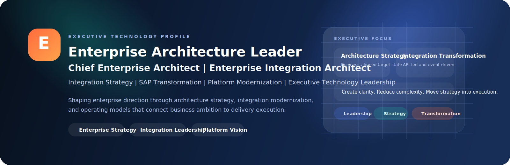

<p align="center">
  
</p>

<h1 align="center">Enterprise Architecture Leader | Integration Strategy | SAP Transformation | Platform Modernization</h1>

<p align="center">
  Enterprise Architecture. Integration Strategy. Platform Modernization. Transformation Leadership.
</p>

<p align="center">
  <strong>19+ Years</strong> |
  <strong>SAP Integration Suite</strong> |
  <strong>API-led Architecture</strong> |
  <strong>Event-Driven Systems</strong> |
  <strong>Agentic AI</strong> |
  <strong>Automation</strong> |
  <strong>S/4HANA Transformation</strong>
</p>

<p align="center">
  <a href="https://github.com/engineersonal?tab=repositories">Repositories</a>
  |
  <a href="https://github.com/engineersonal?tab=stars">Stars</a>
  |
  <a href="https://github.com/engineersonal">Profile</a>
</p>

---

## Why This Profile Stands Out

- enterprise architecture depth with leadership-ready positioning
- strong enterprise integration and SAP transformation identity
- modernization language that speaks to both engineering and executives
- professional presentation designed to look intentional, polished, and memorable

---

## Executive Summary

I work at the intersection of enterprise architecture, enterprise integration, cloud modernization, delivery governance, and leadership enablement.
My focus is building technology landscapes that scale operationally, remain secure by design, and help organizations move from fragmented systems toward cohesive digital platforms and stronger operating models.

## About

I am a senior technology professional with deep experience across enterprise architecture, enterprise integration, SAP-led transformation, and platform modernization.

Over the years, I have worked on connecting complex enterprise landscapes through integration strategy, API-led architecture, event-driven patterns, and scalable platform design. My focus is not only on solving technical problems, but on shaping operating models and architecture decisions that help organizations reduce complexity, improve agility, and execute transformation with confidence.

I am particularly interested in leadership roles where I can contribute at a broader strategic level by aligning business goals, enterprise architecture, integration strategy, and modernization roadmaps into clear and executable outcomes.

## About In One Paragraph

I am a technology leader with strong experience in enterprise architecture, enterprise integration, SAP-led transformation, and platform modernization. My focus is on connecting business strategy with scalable architecture, integration operating models, and practical transformation roadmaps that help organizations modernize with clarity, resilience, and execution discipline.

## Executive Snapshot

| What I Bring | Leadership Signal |
| --- | --- |
| Enterprise Architecture | Strategic target-state thinking across business and technology |
| Enterprise Integration | API-led, event-driven, and SAP-centered integration leadership |
| Platform Modernization | Operating model design that reduces friction and complexity |
| Transformation Leadership | Architecture decisions aligned to business outcomes and execution discipline |

## Recruiter Snapshot

If you are evaluating this profile for leadership roles, the clearest themes are:

- 19+ years of enterprise technology experience
- enterprise architecture and integration leadership
- SAP transformation and modernization depth
- platform strategy with execution credibility
- business-aligned transformation thinking

I am especially interested in:

- enterprise architecture strategy
- platform operating models
- cloud transformation and migration roadmaps
- application modernization
- enterprise integration architecture
- API and integration architecture
- middleware and integration platform strategy
- event-driven and service-based enterprise connectivity
- architecture governance and standards
- delivery acceleration through reusable platforms
- engineering leadership and decision frameworks

---

## Architecture Lens

I approach architecture as a business capability, not just a technical discipline.

That usually means:

- translating business priorities into target-state architecture
- rationalizing portfolios and reducing unnecessary platform sprawl
- integrating business-critical systems across domains and platforms
- shaping reference architectures that product teams can actually adopt
- creating guardrails that improve speed, security, and consistency together
- balancing long-term architectural integrity with delivery pragmatism

---

## Leadership Narrative

I am increasingly focused on leadership roles where architecture is expected to shape enterprise direction, not just solution delivery.

That includes:

- aligning technology investment with business priorities
- influencing modernization agendas across business units
- simplifying complexity for executive stakeholders
- creating transformation roadmaps that are both strategic and executable
- building confidence across engineering, product, operations, and leadership teams

---

## Core Areas Of Practice

### Enterprise Architecture

- target operating models
- capability mapping
- architecture roadmaps
- domain-aligned platform design
- governance and review processes

### Cloud And Platform Engineering

- hybrid and multi-cloud strategy
- landing zones and platform foundations
- observability and reliability patterns
- security baselines and compliance guardrails
- internal developer platforms

### Integration And Data

- API-first architecture
- event-driven systems
- service decomposition
- enterprise integration patterns
- middleware modernization
- ERP, CRM, data, and platform connectivity patterns
- data platform alignment across domains

### Delivery And Transformation

- modernization planning
- architecture runway for product teams
- reusable standards and accelerators
- technical due diligence
- stakeholder communication for executive audiences

---

## What You Will Find In My GitHub

- working prototypes that explore enterprise-grade ideas in practical ways
- architecture-oriented application builds with strong UX and product thinking
- platform and delivery patterns that support real-world modernization
- integration-led solution thinking across enterprise systems
- reference implementations that bridge strategy and execution

---

## Professional Principles

```text
Architect for clarity.
Standardize where it creates leverage.
Decouple where it protects change.
Automate where it removes friction.
Govern with empathy.
Modernize with purpose.
```

---

## Selected Focus Topics

| Focus Area | Perspective |
| --- | --- |
| Enterprise Platforms | Build once, enable many teams, govern through standards and paved roads |
| Cloud Modernization | Move beyond lift-and-shift toward resilient operating models |
| Enterprise Integration | Connect core systems through durable APIs, events, and governed integration patterns |
| Architecture Governance | Replace gatekeeping with clear, decision-oriented guidance |
| Developer Experience | Treat internal platforms as products with adoption in mind |
| Transformation Leadership | Connect architecture decisions directly to business outcomes |

---

## Profile Positioning

If you are visiting this profile, the themes you should expect are:

- executive-level architecture thinking
- enterprise modernization depth
- practical engineering credibility
- professional presentation
- systems-level decision making

---

## Suggested Bio For GitHub

```text
Technology Leader | Enterprise Architecture | Enterprise Integration | Cloud Modernization | Platform Strategy
```

## Suggested About / Intro

```text
Technology leader with deep experience in enterprise architecture, enterprise integration, and platform modernization. I focus on shaping scalable operating models, aligning technology with business goals, and leading transformation with clarity and execution discipline.
```

## Contact

Open to leadership conversations in enterprise architecture, integration strategy, platform modernization, and transformation.

- Email: `engineersonal@gmail.com`
- LinkedIn: `https://www.linkedin.com/in/sonal-sharma-6b6a1b5/`

---

## Connect

If your interest is in:

- enterprise architecture leadership
- enterprise integration strategy
- SAP and platform modernization
- transformation-focused architecture roles
- strategic technology leadership

I am always happy to connect with professionals working across architecture, integration, digital transformation, and enterprise platform strategy.

---

